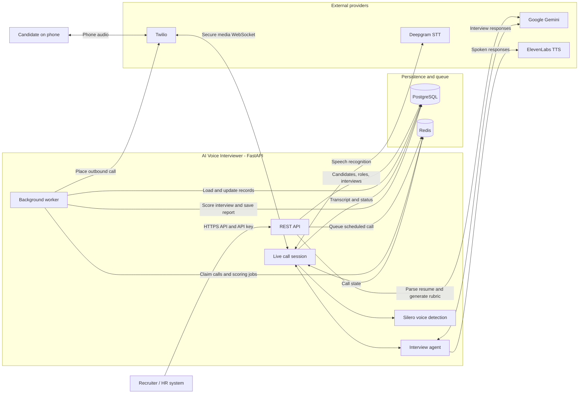

# AI Voice Interviewer

FastAPI backend for scheduling AI-led phone interviews, streaming the conversation, and generating interview reports. See [architecture.md](architecture.md) for the detailed system diagram, interview lifecycle, and component overview.

## Architecture



## Requirements

- Python 3.12 recommended (the Render configuration pins Python 3.12.7).
- PostgreSQL and Redis instances accessible from your machine.
- A Google Gemini API key. Live audio features also need Deepgram and ElevenLabs API keys.
- Twilio credentials and a public HTTPS URL are needed for real phone calls. They are not needed for the local WebSocket simulation.

## Run Locally (Windows PowerShell)

1. Open PowerShell in the project directory and create/activate a virtual environment:

   ```powershell
   py -3.12 -m venv .venv
   .\.venv\Scripts\Activate.ps1
   ```

   If PowerShell blocks activation, use the environment's Python directly as shown in the commands below, or allow script activation for your user according to your organization's policy.

2. Install dependencies and download the local voice-activity model:

   ```powershell
   python -m pip install --upgrade pip
   python -m pip install -r requirements.txt
   python -m scripts.download_vad
   ```

   The model is stored at `models/silero_vad.onnx` and is excluded from Git.

3. Create your local environment file:

   ```powershell
   Copy-Item .env.example .env
   ```

   Edit `.env` and set at least:

   - `PUBLIC_BASE_URL` (for local API development, `http://127.0.0.1:8000` is suitable)
   - `ADMIN_API_KEY`, `INTERNAL_API_TOKEN`, and `STREAM_TOKEN_SECRET` (each at least 16 characters)
   - `DATABASE_URL` and `REDIS_URL`
   - `GEMINI_API_KEY`
   - `DEEPGRAM_API_KEY`, `ELEVENLABS_API_KEY`, and `ELEVENLABS_VOICE_ID` to run the audio simulation

   Generate strong secrets with this PowerShell command, once per secret:

   ```powershell
   python -c "import secrets; print(secrets.token_urlsafe(32))"
   ```

   Use the connection URLs supplied by your PostgreSQL and Redis providers. `DATABASE_URL` should be a PostgreSQL URL; the app converts it for async SQLAlchemy/asyncpg. Do not commit `.env` or share its credentials.

4. Apply database migrations:

   ```powershell
   python -m alembic upgrade head
   ```

5. Start the API (keep this terminal open):

   ```powershell
   python -m uvicorn app.main:app --reload
   ```

   The API is at `http://127.0.0.1:8000`. Check `http://127.0.0.1:8000/health` for `{"status":"ok"}` and open `/docs` for the interactive API docs. The app starts the background worker in the web process by default.

## Verify the Setup

For an end-to-end audio conversation without a phone, open another PowerShell terminal, activate the same `.venv`, and run:

```powershell
python -m scripts.simulate_call
```

This creates temporary interview records, simulates a Twilio media stream, and prints the transcript and scoring report. It requires working PostgreSQL, Redis, Gemini, Deepgram, and ElevenLabs credentials, and makes provider API calls. Temporary candidate and role records are removed afterward; pass `--keep` to retain them.

The API smoke test exercises authenticated endpoints and provider integrations against the configured services:

```powershell
python -m scripts.smoke_test
```

It uses real configured services and makes Gemini requests. Run it only when you are ready to use those credentials and incur any applicable provider usage.

## Real Twilio Calls

For real calls, deploy the service or expose your local server through a public HTTPS tunnel. Set `PUBLIC_BASE_URL` to that externally reachable HTTPS origin, then configure `TWILIO_ACCOUNT_SID`, `TWILIO_AUTH_TOKEN`, and `TWILIO_FROM_NUMBER` in `.env`. When the app places an outbound call, it supplies Twilio with the generated TwiML and these service URLs:

- `POST /twilio/status/{interview_id}` for call status callbacks
- `POST /twilio/twiml/{interview_id}` for media-stream reconnects
- `wss://<PUBLIC_BASE_URL>/media-stream/{interview_id}` for the bidirectional audio stream

Twilio must be able to reach the service over HTTPS and secure WebSockets. Schedule the interview through the API, or start a scheduled interview with `POST /interviews/{interview_id}/start` and the `X-Internal-Token` header. Keep `TWILIO_VALIDATE_SIGNATURES=true` outside isolated local testing.

### Automatic FDE Intake

`POST /interviews/intake` accepts a resume, email, phone, and `candidate_consented=true` as multipart form data. It extracts the candidate name from the resume, creates or reuses the Forward Deployed Engineer role (4-5 years; Python, FastAPI, and React), creates a 15-minute interview, records the consent timestamp, and queues the call immediately. The in-process worker places the outbound call. This endpoint requires `X-API-Key` and can make a real phone call as soon as the worker claims the queue item; use it only after the candidate has agreed to the AI interview and transcription.

Open `/docs`, select `POST /interviews/intake`, enter the form fields, upload a PDF or DOCX resume, and set `candidate_consented` to `true` only after consent has been obtained. The phone must be in E.164 format. A successful response includes the candidate, role, and interview IDs. Check `/interviews/{interview_id}` for call status, then `/transcript` and `/report` for results. Apply the new database migration before using this endpoint (`alembic upgrade head`); Render's configured start command does this before launching Uvicorn.

## Deploy to Render

### Optional Groq Resume Parsing

To avoid Gemini availability errors during resume parsing, set `RESUME_PROVIDER=groq`, `GROQ_API_KEY` to your Groq secret, and `GROQ_RESUME_MODEL=llama-3.3-70b-versatile` in the web service environment, then redeploy. Groq receives extracted PDF or DOCX text, not the original file. Scanned/image-only PDFs require OCR or `RESUME_PROVIDER=gemini`. Groq JSON responses are validated against the resume schema. Gemini remains the default; interview conversation, rubric generation, and scoring still use Gemini and require `GEMINI_API_KEY`. Provider limits and outages can still cause parsing failures.

Run the isolated resume-provider checks with `python -m unittest scripts.test_resume_parser`; these tests do not call external APIs or schedule interviews.

The included `render.yaml` describes a free web service for testing, including dependency installation, Silero model download, migration command, health check, and runtime settings. Create the PostgreSQL and Redis services separately, then provide their URLs and the required provider credentials as Render environment variables. Set `PUBLIC_BASE_URL` to the deployed HTTPS URL. Render applies migrations before starting the service.

Render's pre-deploy command is only available for paid web services, so this single-instance free service runs `python -m alembic upgrade head` in its start command. For an existing service not managed by a Blueprint, update Settings > Start Command to match `render.yaml` and redeploy. The server will not start if migrations fail. If you scale to multiple instances, move migrations to a dedicated deployment step.

The free web service can spin down when idle and restart at any time, so use it for testing rather than relying on it for live phone interviews. If you use Render's free Postgres, its database expires after 30 days; free Key Value (Redis) data is not persisted across restarts. Upgrade the web service and choose durable data stores before production use.

## Useful Commands

```powershell
python -m alembic upgrade head       # Apply database migrations
python -m scripts.download_vad       # Fetch the Silero ONNX model
python -m uvicorn app.main:app --reload  # Run the development server
python -m scripts.simulate_call     # Simulate a complete audio interview
python -m scripts.smoke_test        # Exercise API flows against configured services
```