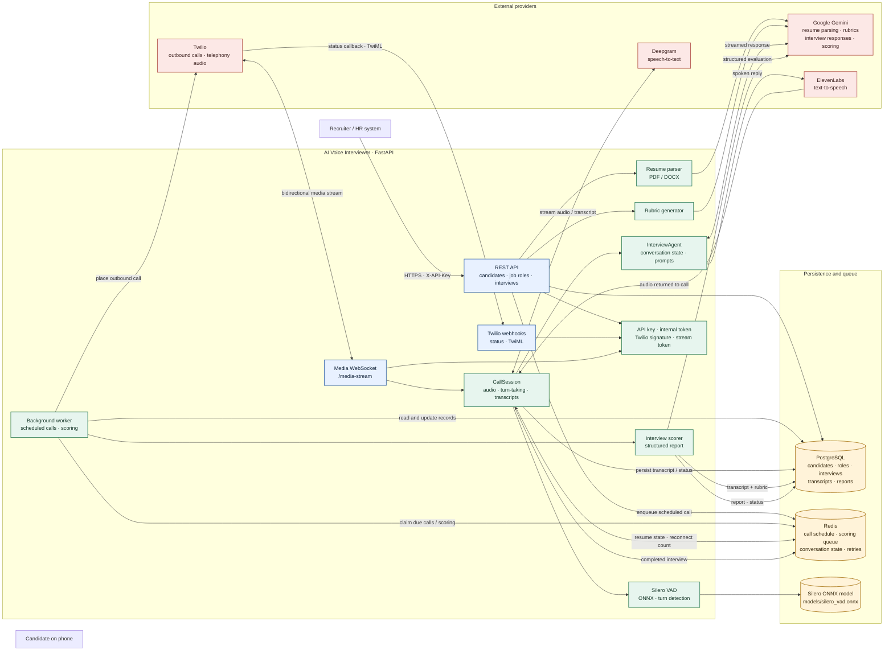
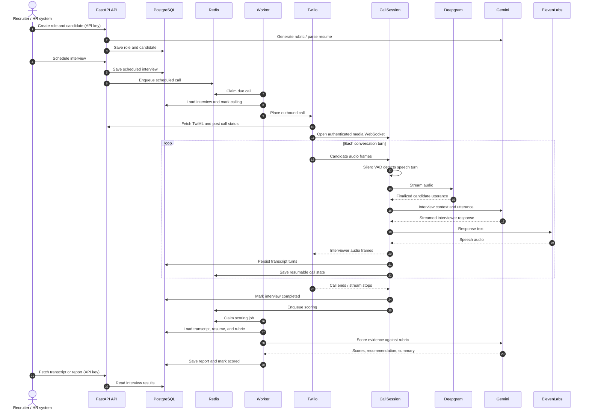

# AI Voice Interviewer Architecture

An asynchronous FastAPI service that turns candidate and job-role data into scheduled phone interviews, streams each conversation in real time, and produces a rubric-based report.

## System Overview

## Interview Lifecycle

## Component Responsibilities

| Area | Responsibility |
| --- | --- |
| `app/main.py` | Builds the FastAPI app, includes routers, loads VAD, starts the in-process worker, and closes shared clients on shutdown. |
| `app/routers/` | Authenticated candidate, job-role, and interview APIs; Twilio callbacks and media WebSocket. |
| `app/services/call_session.py` | Owns one live call: VAD turn detection, streaming STT/LLM/TTS, barge-in, transcript persistence, and reconnect handling. |
| `app/services/interviewer.py` | Interview context, conversation state, question flow, and streamed responses. |
| `app/services/scoring.py` | Scores completed interviews against the role rubric and writes the report. |
| `app/services/resume_parser.py`, `rubric.py` | Extracts resume data and prepares job-specific interview rubrics with Gemini. |
| `app/worker.py`, `app/redis_store.py` | Dispatches due calls, queues scoring, retries scoring, and stores resumable call state. |
| `app/models.py`, `app/db.py`, `alembic/` | SQLAlchemy data model, async PostgreSQL access, and schema migrations. |
| `app/services/stt.py`, `tts.py`, `gemini.py`, `twilio_client.py`, `vad.py` | Provider adapters and local voice-activity detection. |

## Runtime Notes

- The default deployment runs one web instance with the worker inside that same process (`RUN_WORKER_IN_WEB=true`). The Redis queue and PostgreSQL records are the durable scheduling/recovery sources; active WebSocket sessions are process-local.
- PostgreSQL stores business records and interview artifacts. Redis stores transient scheduling/queue entries, retry timing, reconnect counters, and conversation state with a TTL.
- The public deployment must expose HTTPS and secure WebSockets so Twilio can reach the webhook and media-stream endpoints. `PUBLIC_BASE_URL` is used to validate Twilio signatures and construct callback URLs.
- `app/main.py` exposes `/health` for deployment health checks. FastAPI's interactive API documentation is available at `/docs` when the service is running.